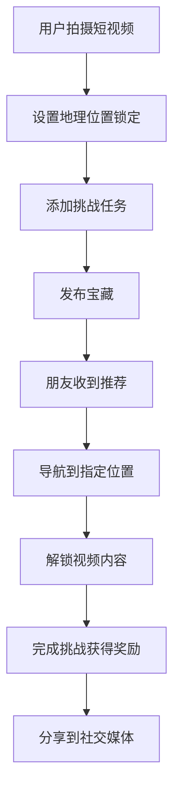
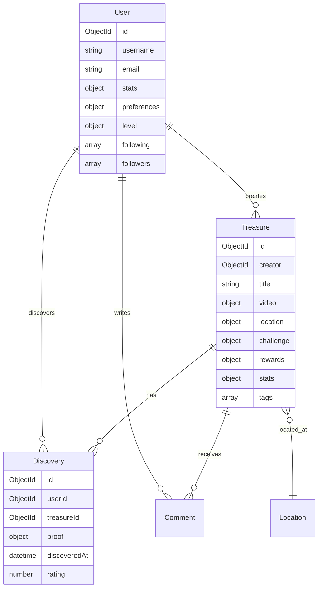

# 🎬 抖宝 - DouyinTreasure

> **每个地点都有故事，每个故事都值得发现**

[](https://opensource.org/licenses/MIT)
[](https://nodejs.org/)
[](https://mongodb.com/)
[](https://github.com/yourusername/douyin-treasure/pulls)

基于地理位置服务(LBS)的短视频寻宝社交平台，结合AI智能推荐和病毒式传播机制，鼓励用户走出室内，探索真实世界。

## ✨ 产品亮点

🎥 **短视频寻宝** - 创建位置锁定的短视频内容，必须到达指定地点才能观看  
🤖 **AI智能推荐** - 基于用户兴趣、位置、行为的个性化内容推荐  
🔥 **病毒式传播** - 朋友圈分享、群体挑战、智能组队等社交机制  
📱 **移动端优化** - 完美适配iOS/Android，支持React Native和微信小程序  
🗺️ **高精度定位** - 集成高德地图和北斗定位，支持5-200米精确发现半径  
🏆 **游戏化体验** - 等级系统、成就徽章、积分奖励、排行榜  

## 🎯 目标用户

- **年轻群体** (18-35岁) - 追求新鲜体验的城市探索者
- **社交达人** - 喜欢与朋友分享生活的内容创作者  
- **户外爱好者** - 希望走出室内、探索城市的活跃用户
- **品牌商家** - 寻求创新营销方式的线下商业

## 🚀 快速开始

### 环境要求
- Node.js >= 16.0.0
- MongoDB >= 5.0
- Redis >= 6.0 (可选)
- FFmpeg (视频处理)

### 安装启动
```bash
# 克隆项目
git clone https://github.com/yourusername/douyin-treasure.git
cd douyin-treasure

# 安装依赖
npm install

# 配置环境变量
cp env.example .env
# 编辑 .env 文件，配置数据库和API密钥

# 启动开发服务器
npm run dev
```

详细配置请参考 [快速启动指南](./QUICKSTART.md)

## 📱 产品演示

### 核心功能流程


### 核心界面
| 功能 | 截图 | 描述 |
|------|------|------|
| 🗺️ 地图探索 | `即将上传` | 显示附近宝藏，支持筛选和搜索 |
| 🎬 视频录制 | `即将上传` | 内置滤镜和特效的视频录制 |
| 📍 位置设置 | `即将上传` | 精确的地理位置锁定 |
| 🏆 个人中心 | `即将上传` | 等级、徽章、统计数据 |

## 🛠️ 技术架构

### 后端技术栈
- **Node.js + Express** - RESTful API服务器
- **MongoDB + Mongoose** - 数据存储和ODM
- **Socket.IO** - 实时通信
- **Redis** - 缓存和会话管理
- **JWT** - 用户身份认证
- **Multer + Sharp** - 文件上传和图片处理
- **FFmpeg** - 视频处理和压缩

### 前端技术栈
- **React + TypeScript** - Web端应用
- **React Native** - 移动端应用
- **Redux Toolkit** - 状态管理
- **React Router** - 路由管理
- **Ant Design Mobile** - UI组件库
- **高德地图 JS API** - 地图服务

### 基础设施
- **阿里云/腾讯云** - 云服务器和CDN
- **MongoDB Atlas** - 云数据库
- **Redis Cloud** - 云缓存
- **OSS/COS** - 对象存储
- **Docker + K8s** - 容器化部署

## 📊 数据模型

### 核心实体关系


## 🎮 游戏机制

### 等级系统
- **新手探险者** (Level 1-10) - 基础功能
- **城市探索家** (Level 11-30) - 解锁高级特效
- **寻宝大师** (Level 31-50) - 创建特殊宝藏
- **传奇冒险家** (Level 51+) - 专属徽章和特权

### 积分奖励
- 📹 **创建宝藏**: +10-50分 (根据质量)
- 🎯 **发现宝藏**: +5-20分 (根据难度)
- 👍 **获得点赞**: +1分/个
- 📤 **成功分享**: +3分/次
- 🏆 **完成挑战**: +额外奖励

### 成就徽章
- 🥇 **首次发现** - 发现第一个宝藏
- 🎬 **内容创作者** - 创建10个宝藏
- 🌟 **人气王** - 获得100个点赞
- 🗺️ **城市探索家** - 探索5个不同区域
- 👥 **社交达人** - 邀请10个朋友

## 💰 商业模式

### 收入来源
1. **会员订阅** (40%) - 高级功能和特权
2. **商家合作** (35%) - 位置推广和品牌活动
3. **虚拟道具** (15%) - 特效、道具、徽章
4. **数据服务** (10%) - 位置热度和用户行为分析

### 会员特权
- ✅ 无限创建宝藏 (免费用户限制10个/月)
- ✅ AI个性化推荐
- ✅ 专属滤镜和特效
- ✅ 优先客服支持
- ✅ 数据分析报告

## 📈 产品路线图

### Phase 1: MVP版本 (2个月)
- [x] 用户注册登录系统
- [x] 基础短视频录制上传
- [x] 地理位置服务集成
- [x] 宝藏创建和发现机制
- [ ] 简单的社交功能

### Phase 2: 增强体验 (1个月)
- [ ] AI内容推荐算法
- [ ] 高级视频编辑功能
- [ ] 群组和好友系统
- [ ] 推送通知服务
- [ ] 等级和成就系统

### Phase 3: 社交爆发 (1个月)
- [ ] 智能组队匹配
- [ ] 群体挑战模式
- [ ] 病毒式分享机制
- [ ] 排行榜和竞赛
- [ ] 内容审核系统

### Phase 4: 商业化 (1个月)
- [ ] 会员订阅系统
- [ ] 商家合作平台
- [ ] 虚拟道具商店
- [ ] 数据分析后台
- [ ] 广告投放系统

## 🤝 贡献指南

我们欢迎所有形式的贡献！请阅读 [CONTRIBUTING.md](./CONTRIBUTING.md) 了解详细信息。

### 开发流程
1. Fork 项目
2. 创建功能分支 (`git checkout -b feature/AmazingFeature`)
3. 提交更改 (`git commit -m 'Add some AmazingFeature'`)
4. 推送到分支 (`git push origin feature/AmazingFeature`)
5. 创建 Pull Request

### 代码规范
- 使用 ESLint 和 Prettier 保持代码风格一致
- 编写测试用例覆盖新功能
- 遵循语义化版本控制 (SemVer)
- 提交信息遵循 Conventional Commits 规范

## 📄 许可证

本项目采用 MIT 许可证 - 查看 [LICENSE](./LICENSE) 文件了解详情。

## 📞 联系我们

- 📧 **邮箱**: dev@douyintreasure.com
- 💬 **微信群**: 扫码加入开发者交流群
- 🐛 **问题反馈**: [GitHub Issues](https://github.com/yourusername/douyin-treasure/issues)
- 📚 **文档中心**: https://docs.douyintreasure.com

## ⭐ 支持项目

如果你觉得这个项目有价值，请给我们一个 Star ⭐️

感谢所有贡献者的支持！

[](https://github.com/yourusername/douyin-treasure/graphs/contributors)

---

<div align="center">
  <p><strong>🎯 抖宝 - 让每个地点都有故事，让每个故事都值得发现！</strong></p>
  <p>Made with ❤️ by DouyinTreasure Team</p>
</div>